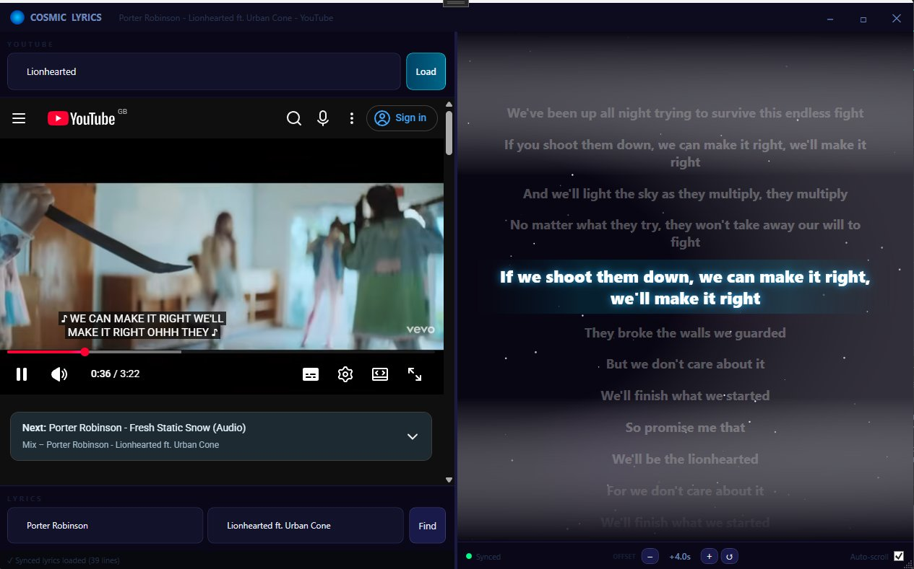

# 🌌 Cosmic Lyrics


A WPF desktop app that plays YouTube videos with **animated, time-synced lyrics** in a cinematic cosmic style — inspired by the "Princes of the Universe" typography aesthetic.



---

## ✨ Features

| Feature | Details |
|---|---|
| **YouTube playback** | Full YouTube in-app via WebView2 (Chromium) |
| **Time-synced lyrics** | Word-by-word sync via LRC timestamps |
| **Auto-scroll** | Active lyric centers itself with smooth animation |
| **Cosmic background** | 180 twinkling stars + 6 drifting nebula blobs, all animated |
| **Active lyric glow** | Current line glows, scales up, other lines fade |
| **Auto-detect metadata** | Parses Artist — Title from YouTube page title |
| **Lyrics search** | Free API via lrclib.net — no key required |
| **Borderless window** | Custom title bar with drag/maximize/minimize |

---

## 🚀 Getting Started

### Prerequisites
- **Visual Studio 2022** (or Rider) with .NET 8 workload
- **Windows 10/11** (WebView2 comes pre-installed on Win11; Win10 may need the runtime)
- Internet connection (for YouTube + lyrics API)

### Build & Run

```bash
# Clone / open the solution
cd CosmicLyrics
dotnet restore
dotnet build
dotnet run --project CosmicLyrics
```

Or open `CosmicLyrics.sln` in Visual Studio and press **F5**.

### WebView2 Runtime (if needed on older Windows 10)
Download from: https://developer.microsoft.com/microsoft-edge/webview2/

---

## 🎵 How to Use

1. **Paste a YouTube URL** into the top bar and press Enter or click "Load"
   - e.g. `https://www.youtube.com/watch?v=dQw4w9WgXcQ`
2. The app auto-detects **Artist** and **Track** from the page title and fetches lyrics
3. If lyrics aren't found automatically, **edit the Artist/Track fields** and click "Find"
4. Watch the **cosmic lyric display** sync in real-time!

### Tips
- Works best with music videos, lyric videos, and official audio uploads
- You can also **search** by typing any text (non-URL) — it opens YouTube search
- Toggle **Auto-scroll** off to read ahead or back
- The **green dot** = time-synced lyrics are loaded

---

## 🏗️ Architecture

```
CosmicLyrics/
├── App.xaml                    # Application entry, converters, global styles
├── Converters.cs               # BoolToVisibility converters
│
├── Models/
│   └── LyricLine.cs            # LyricLine model + LrcParser (LRC format)
│
├── Services/
│   ├── LyricsService.cs        # lrclib.net API client
│   └── YouTubeService.cs       # URL parsing, title parsing
│
├── ViewModels/
│   └── MainViewModel.cs        # INotifyPropertyChanged VM, sync logic
│
├── Controls/
│   ├── CosmicCanvas.cs         # Animated star/nebula WPF Canvas
│   ├── LyricLineView.xaml      # Individual lyric line with animations
│   └── LyricLineView.xaml.cs
│
├── Views/
│   ├── MainWindow.xaml         # Main layout
│   └── MainWindow.xaml.cs      # WebView2 JS bridge, scroll animation
│
└── Resources/
    └── Styles.xaml             # Dark cosmic UI styles
```

### Lyric Sync Flow

```
YouTube video playing
    │
    ▼  (every 250ms via JavaScript)
WebView2 JS bridge polls video.currentTime
    │
    ▼  postMessage → CoreWebView2.WebMessageReceived
MainWindow.OnWebMessageReceived()
    │
    ▼
MainViewModel.UpdatePlaybackTime(seconds)
    │
    ▼  binary search through LyricLine list
Find active LyricLine (last line with Timestamp ≤ currentTime)
    │
    ▼
IsActive = true on that line → LyricLineView plays ActivateAnimation
    │
    ▼
ScrollViewer smooth-scrolls to center the active line
```

---

## 🔧 Extending

### Add word-level highlighting
Replace the `Text` binding with a custom `InlineCollection` that highlights
each word as the line progresses. Use the next line's timestamp to compute
per-word duration: `wordDuration = (nextLine.Timestamp - thisLine.Timestamp) / wordCount`.

### Bundle a custom font
Add the font to `Resources/Fonts/`, set Build Action = Resource, then reference as:
`FontFamily="pack://application:,,,/Resources/Fonts/#FontName"`

### Offline lyrics
Add a file picker to load `.lrc` files directly:
```csharp
var dlg = new OpenFileDialog { Filter = "LRC files|*.lrc" };
if (dlg.ShowDialog() == true)
    _vm.LoadLrcFile(await File.ReadAllTextAsync(dlg.FileName));
```

---

## 🚀 CI / Releases

Every push to `master` automatically:
1. Builds a **self-contained single-file** `win-x64` executable (no .NET install needed on the target machine)
2. Versions it as `1.0.<commit-count>`
3. Creates a **GitHub Release** with a zip attached

The workflow is at `.github/workflows/release.yml`. To use it:
1. Push the repo to GitHub
2. Go to **Settings → Actions → General** and ensure workflow permissions are set to *Read and write*
3. Push any commit to `master` — a release appears automatically under the **Releases** tab

> **Note:** Replace `YOUR_USERNAME` in the README badge URL with your actual GitHub username.

---

## 📦 NuGet Dependencies

| Package | Purpose |
|---|---|
| `Microsoft.Web.WebView2` | Chromium-based browser in WPF |
| `CommunityToolkit.Mvvm` | INotifyPropertyChanged helpers |
| `Newtonsoft.Json` | JSON parsing for lrclib API + JS bridge |

---

## 🙏 Credits

- **Lyrics API**: [lrclib.net](https://lrclib.net) — free, no-auth LRC lyrics
- **YouTube playback**: Microsoft WebView2
- Inspired by the Queen *"Princes of the Universe"* lyric typography aesthetic
